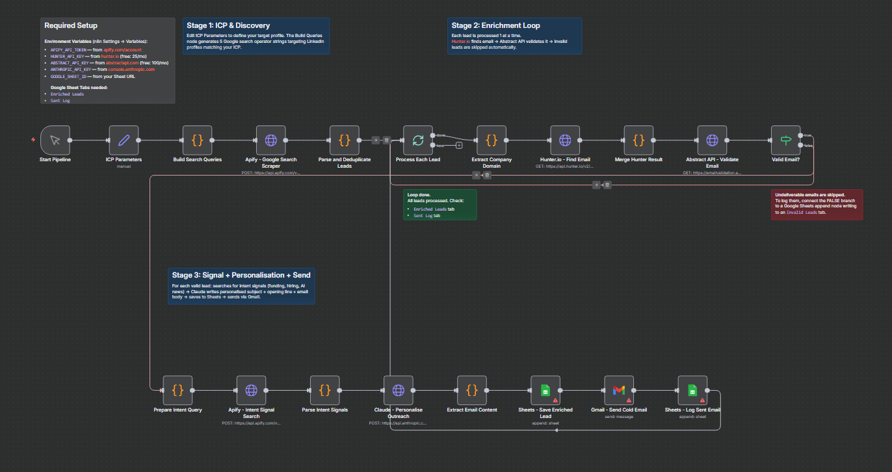

# 👋 Hi, I'm Abhay Suman

**Growth & GTM-Focused Marketer | AI-Driven Campaigns | Demand Generation | SEO & Paid Media**

📧 abhaysuman60@gmail.com | 📱 8630892870 | [LinkedIn](https://www.linkedin.com/in/abhay-suman/)

---

## 🚀 About Me

I'm a growth and go-to-market marketer with hands-on experience across outbound, demand generation, SEO, paid media, and AI-driven GTM systems. I've scaled pipelines, built ICP-led strategies, and supported founders in early-stage execution — blending marketing, analytics, and product thinking to drive measurable results.

**Recent highlights:**
- 📈 Scaled outbound from 4,000 → 10,000 emails/month for AI & cloud GTM campaigns
- 🔗 Grew a LinkedIn audience from 40K → 77K followers and a newsletter from 0 → 10K+ subscribers in 5 months
- 🎯 Generated 100+ MQLs from zero within 4 months, converting 20–30 SQLs/month

---

## 🛠️ Task: 100Hires Portfolio Setup

This repository documents my completion of the **100Hires Junior Growth Marketing Specialist** portfolio task. The process required me to set up a developer environment, use AI coding tools, and push work to GitHub — all without prior experience in these tools.

---

### ✅ Tools I Installed

| Tool | Purpose |
|------|---------|
| **Cursor IDE** | AI-powered code editor — installed from [cursor.com](https://cursor.com) |
| **Claude Code** (Cursor Extension) | Anthropic's AI assistant for coding, writing, and task execution |
| **Codex** (Cursor Extension) | OpenAI's coding model — added via Extensions inside Cursor |
| **Git** | Version control — for committing and pushing code to GitHub |
| **GitHub Account** | Already active — used to host this public repository |

---

### 📋 Steps I Completed

1. **Read and understood the brief** from Alex Kravets (CEO, 100Hires)
2. **Downloaded and installed Cursor IDE** from [cursor.com](https://cursor.com)
3. **Added the Claude Code extension** inside Cursor via Extensions → searched "Claude Code" → logged in
4. **Added the Codex extension** inside Cursor via Extensions → searched "Codex" → logged in
5. **Created a public GitHub repository** named `Portfolio` at [github.com/abhaysuman/Portfolio](https://github.com/abhaysuman/Portfolio)
6. **Opened the repository in Cursor** using File → Open Folder
7. **Created this README.md** file documenting the entire process
8. **Committed and pushed** the file to GitHub using Git

---

### ⚡ Issues I Ran Into — and How I Solved Them

**Issue 1: Git not configured on my machine**
> When I tried to push to GitHub, Git threw an error saying my identity wasn't set.
> **Fix:** I ran `git config --global user.email` and `git config --global user.name` to set my credentials, then pushed again successfully.

**Issue 2: Cursor Extensions panel was confusing at first**
> The Extensions panel in Cursor looks slightly different from VS Code, and I wasn't sure where to search.
> **Fix:** I clicked the "Extensions" icon in the sidebar (or pressed `Ctrl+Shift+X`), typed "Claude Code" in the search bar, and found the extension immediately.

**Issue 3: SSH vs HTTPS for GitHub**
> The repository push failed the first time because of authentication.
> **Fix:** I switched to HTTPS with a personal access token (created in GitHub Settings → Developer Settings → Personal Access Tokens) and the push worked.

---
## ⚙️ n8n Automation Projects
 
### 1. AI-Powered Lead Generation Agent
**Stack:** n8n · Apify · Google Sheets · JavaScript
 
A fully automated agent that accepts a target industry niche and company age filter as inputs, then autonomously discovers founders of early-stage companies — with zero manual research. Results are written directly to a Google Sheet, ready for outreach.
 
- Generates 5 targeted LinkedIn search strings from a single niche input
- Uses free-tier Apify actor with async run polling — no paid APIs
- Custom JavaScript extracts founder name, title, company, website, LinkedIn URL, founding year, and estimated age with regex-based age filtering
- Writes up to 200 leads in batches of 10 using a SplitInBatches loop with deduplication
- Single-node config — change niche or age filter without touching any other node
> 12 workflow nodes · 5 search query variants · 200 leads per run · 9 structured fields
 
---
 
### 2. AI-Powered Outbound Pipeline *(Work in Progress)*
**Stack:** n8n · Apify · Claude AI · Hunter.io · Abstract API · Google Sheets · Gmail API
 
A fully automated B2B outbound system built as a solo marketing hire with zero tool budget. Takes an ICP definition as input and autonomously discovers leads, enriches contact data, researches buying signals, generates personalised outreach using AI, and sends cold emails — end to end.
 
- Scrapes 300+ LinkedIn profiles per run via Apify using Google operator search queries from ICP parameters
- Enriches each lead with verified email via Hunter.io, validates deliverability via Abstract API
- Searches for live intent signals — funding rounds, AI hiring activity, product launches
- Uses Claude AI to write a personalised subject line, opening sentence, and email body per lead
- Saves enriched leads and email copy to Google Sheets, sends via Gmail, logs all activity
**Problems solved:** Eliminated 10+ hours/week of manual lead research across 5–6 tools. Built entirely on free-tier APIs — no Apollo, no ZoomInfo, no paid sales tools.
 
---
 
### 3. Automated Email Campaign Pipeline
**Stack:** n8n · Google Sheets · Microsoft Outlook · Gmail · Canva HTML Export
 
A no-code automation workflow that pulls lead data from Google Sheets and sends a branded HTML email campaign at scale with zero manual intervention per send.
 
- Reads all leads from a Google Sheets database on trigger
- Loops through each lead individually using a batched iterator to respect rate limits
- Sends a fully designed HTML email (exported from Canva) to each lead
- Configured for both Microsoft Outlook (via Azure OAuth2) and Gmail (via OAuth2)

---
### 4. Personalised Icebreaker Generator
**Stack:** n8n · Apify
 
A workflow that scrapes live signals from a company's website and a prospect's LinkedIn profile, then auto-generates personalised icebreakers for LinkedIn or cold email outreach campaigns — making every message feel hand-written at scale.
 
---

## 💼 My Marketing Toolkit

```
SEO & Content        →  SEMrush, Ahrefs, Surfer SEO, Screaming Frog, Google Search Console
Paid Media           →  Google Ads, Meta Ads, Landing Page Optimization
Outbound & Email     →  Instantly, Smartlead, Lemlist, Apollo
LinkedIn & Social    →  LinkedIn Sales Navigator, PhantomBuster, Scripe.io, Hootsuite, Buffer
CRM & Automation     →  n8n, Zapier, Clay, Octave
AI Tools             →  ChatGPT, Claude, Perplexity, NotebookLM, Copy.ai
Analytics            →  Google Analytics, Looker Studio, A/B Testing
Design               →  Canva, Adobe Photoshop, Illustrator, Figma
Project Mgmt         →  Notion, Slack, ClickUp, Trello
```

---

## 📂 Experience Snapshot

**Marketing Executive @ BigStep Technologies** *(Sept 2025 – Present)*
Built and scaled AI & cloud GTM campaigns, grew LinkedIn audience and newsletter from scratch, generated 100+ MQLs in 4 months.

**Marketing Executive @ Whizzme** *(Jan 2025 – Sept 2025)*
Led SEO growth, optimized Google & Meta Ads, built lead-gen workflows using email automation and funnel analysis.

**Digital Marketing Intern @ Learn with Fraternity** *(Jul – Sept 2024)*
Executed off-page SEO, link-building, and keyword research to improve domain authority.

**Sales & Marketing Intern @ Universal Tribes** *(Aug – Sept 2024)*
Built outreach strategies, digital marketing campaigns, and pitch decks.

---

## 🎓 Education

- **MBA** in Marketing & Business Analytics — Graphic Era Hill University *(2023–2025)*
- **B.Tech** in Information Technology — Graphic Era Hill University *(2020–2023)*

---

## 🔗 This is just the beginning.

This portfolio will grow as I complete more steps in the 100Hires process — demonstrating research, synthesis, judgment, and AI-tool skills that any forward-thinking company would value.

> *"Finding answers on your own is part of what we're looking for."* — Alex Kravets, CEO, 100Hires
